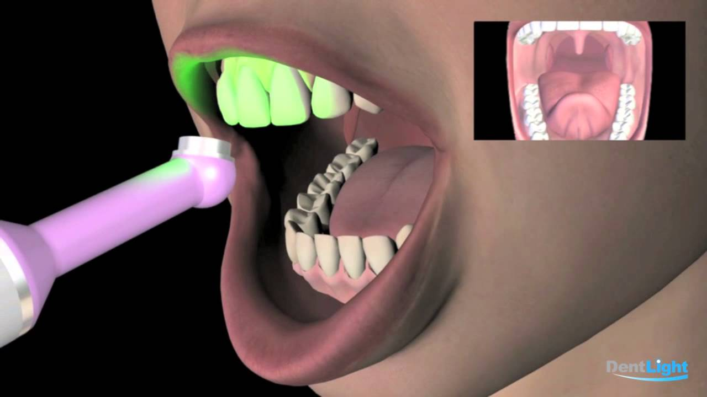
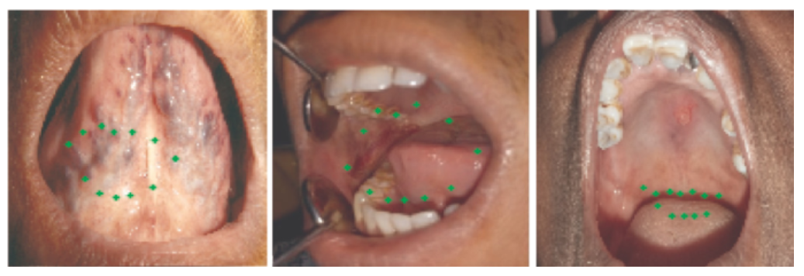

# 🦷 Oral Lesions Detection App

## 📌 Overview
This repository contains the implementation of a deep learning model (CNN) designed to detect oral lesions and classify them as **benign** or **malignant**. The model was trained using a public dataset sourced from [Mendeley Data](https://data.mendeley.com/datasets/mhjyrn35p4/2) and available on [Kaggle](https://www.kaggle.com/datasets/mohamedgobara/oral-lesions-malignancy-detection-dataset).

> 📂 Dataset by Chandrashekar H S, Geetha Kiran A, Murali S, Dinesh M S, Nanditha B R  
> 🗓 Published: 5 February 2021 | DOI: [10.17632/mhjyrn35p4.2](https://doi.org/10.17632/mhjyrn35p4.2)  

---

## 📊 Dataset Description

- The dataset includes **color images** of oral lesions captured with mobile and intraoral cameras.
- **Classes**: 165 benign lesions, 158 malignant lesions.
- **Folders**:
  - `original_data`: Raw, labeled images.
  - `augmented_data`: Transformed images using flipping, rotation, and resizing.

---

## 🧠 Model Architecture

### 1. **Model Building**
A **Convolutional Neural Network (CNN)** is built using **TensorFlow** and **Keras**. The architecture consists of:
- Multiple `Conv2D` layers
- `BatchNormalization`, `MaxPooling2D`
- Final classification layers with softmax activation

### 2. **Model Training**
- Images are resized and normalized.
- Labels are encoded (benign/malignant).
- The model is trained to learn image features and classify the lesion.

### 3. **Model Evaluation**
- Evaluated on validation data using:
  - Accuracy
  - Precision
  - Recall
  - Confusion Matrix

### 4. **Model Deployment**
- Final trained model saved as: `CNN_model__.h5`
- Used in a **Streamlit** web application for real-time image classification.

### 5. **Prediction Process**
- The user uploads an oral lesion image.
- The CNN model predicts class and confidence.
- Results are rendered immediately in the browser.

### 6. **Result Display**
- Predictions are shown with a **confidence score**.
- If malignant, the app advises the user to consult a medical professional.

---

## 🚀 How the App Works

1. **Upload an Image**: A clear image of the oral lesion is uploaded.
2. **Click Predict**: The app feeds the image into the CNN model.
3. **Receive Results**: Instantly get a classification (benign or malignant) with a confidence score.

---

## 🧰 Requirements

```
numpy==1.24.3  
streamlit==1.34.0  
tensorflow==2.14.0  
Pillow==9.2.0
---

## 📸 Screenshots


---

## 🙋‍♀️ Author

**Hadeer Badr Hassan**  
💻 A Computer Science Student – South Valley University  
🌍 Passionate about AI for healthcare & practical deep learning  
🔗 [LinkedIn](https://www.linkedin.com/in/hadeer-badr) | 📧 hadeerb47@gmail.com  

---

> *“Code that saves lives is the code that matters most.”*  
> — ✨ *Hadeer Badr Hassan*
